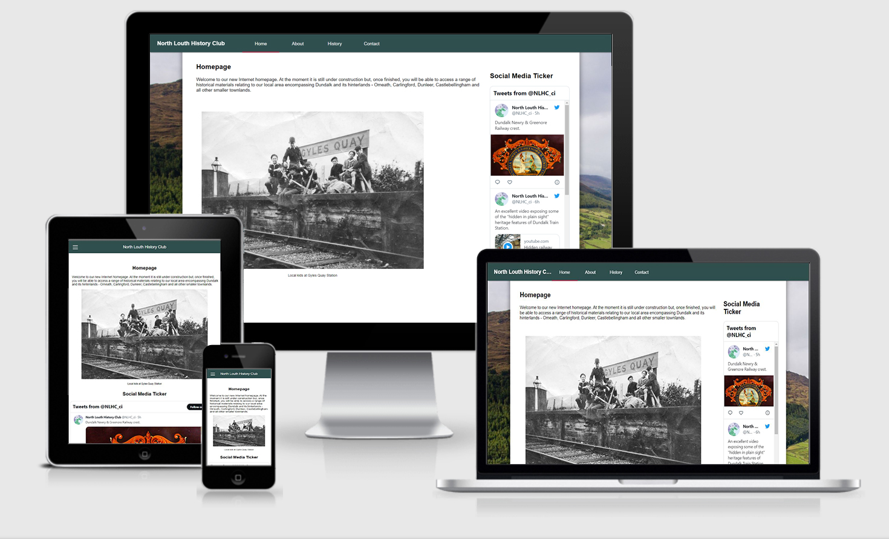

# Site Overview
The name of my Code Institute PP1 site is "North Louth History Club". As the name suggests, it is a site which curates and hosts information about the North Louth area. This site is aimed at North Louth locals in particular, followed by Irish people, followed by anyone who would happen to stumble upon it and take an interest. 
# Table of Contents
* [Technologies Used](#technologies-used)
* [Resources](#Resources)
* [User Stories](#user-stories) 
* [Overview](#Overview)
* [Technical Features](#technical-features)
* [Testing](#testing)
    * [Manual Testing](#manual-testing)
    * [Lighthouse Testing](#lighthouse-testing)
    * [Validator Testing](#validator-testing)
    * [Bugs](#bugs)  
* [Deployment](#deployment)
* [Credits](#credits)  

------

# Technologies Used
- [HTML5](https://en.wikipedia.org/wiki/HTML) for markup 
- [CSS3](https://en.wikipedia.org/wiki/CSS) for the stylesheet 
- [Github]( https://github.com/) for file management & version control 
- [Gitpod]( https://www.gitpod.io/) for code editing and pushing commits

# Resources
- [Code Institute](https://codeinstitute.net/) Course material & the Slack community 
- [W3Schools]( https://www.w3schools.com/) as reference material
- [Mozilla MDN](https://developer.mozilla.org/en-US/docs/Web) as further reference material on HTML/CSS
- [CSSTricks]( https://css-tricks.com/) for CSS tips and tricks
- [StackOverflow](https://stackoverflow.com/) I never get through any project without looking at StackOverflow at least once.
- [Google Material Design Guidelines](https://m2.material.io/design/introduction) as loose inspiration for the site design/styling.
- [Am I Responsive](http://ami.responsivedesign.is/) – generate an image of the site on different sized screens
- [W3C Markup](https://validator.w3.org/) Validate HTML code
- [W3C CSS]( https://jigsaw.w3.org/css-validator/) CSS Validation 

# User Stories

-   As a user I want to primarily see content about the historical subject in question
-	As a user I want to be able to easily navigate through the site
-	As a user I want to not just read about the past, but also see audio/visual content concerning the past.
-	As a user I want to be able to get in touch with the owners of the site and discuss historical matters with them.
-	As a user I want the site to be easy to learn and intuitive; so that any repeat visit will not cause confusion.
-   As a user I want to know where else I might follow the work of the owners of the website

# Overview

This site contains 4 pages:
A Home page with a social media feed and a brief overview of the site
An About page with links to further resources and a disclaimer about the owners of the site
A History page containing the majority of the content & the most important part of the website 
A Contact page which collates all the contact information and methods into one single page. 

The design of each page has been kept clean and ordered in a way that is logical and "flows" well. 
The goal of the site is to make learning about the subject matter an enjoyable and accessible thing - many local history websites are plagued by design that is either bad or is not "responsive" i.e doesn't take well to being shown on a mobile device.

## Technical Features

Flexbox styling and media queries; complete continuity and preservation of features from Desktop to mobile, responsive design from 1920x1080 down to 1152x864 in full desktop mode and support for practically any mobile device. 

Dynamic and lively interactable buttons/fields - all major user input features have dynamic elements on Desktop which make it obvious when you have hovered over them and obvious when you have clicked into them - e.g the styling of the navbar buttons changes when you mouse over them, and a little border line is applied to the bottom of the navbar button which corresponds to the page the user is currently on.

A particular little favourite of mine is the cha/ni map at the bottom of the History page and how it sits beside the text in desktop mode but above it in mobile mode - this is admittedly quite simple and is similar to the operation of the flexboxes on the contact and homepages, but it pleases me.

Another minor feature is that the end of the page title turns to ellipsis when the page is resized horizontally and the navbar buttons collide with it.

Hamburger menu in mobile mode; I believe that in mobile mode it is essential to save space and every industry-standard mobile website uses a hamburger menu - so I sought to find a way to include it in this project. I managed to implement it in a clean way using the Checkbox Hack method which allows for dynamic CSS changes at the click of a button without involving Javascript: https://css-tricks.com/the-checkbox-hack/

Confirmation page upon submission of Contact form; basic validation of user-input (all boxes must be filled in before the form can be sent).

## Future Features
There are more features which I would have liked to add if I had the time, the knowledge, or if the scope called for them. 

I would have liked to implement an interactible Table of Contents and collapsible divs on the History page - i.e users could click to reach a 
certain part of the page, and could also "minimize" that section when they were done with it. I had tried to implement this latter feature using the Checkbox hack method again but the way I had designed it, was throwing up too many W3C validator errors which I could not manage to solve - so I made the divs static instead. With Javascript it would be easier to implement collapsible divs.

As for the Table of Contents, I feel that it is not really worthwhile here; but would be if I had something more like a books worth of content on that page or even just the amount which is contained on a large Wikipedia article - I do not have the time to write more content into the page nor so much that would create a need for subsections under the major headings.

If this were a real historical website; more rigorous sourcing would be necessary.

**September 1 2021:** Remove `PGHOSTADDR` environment variable.

------

## Testing 

I tested the website in Chrome on my desktop and Chrome on my Android devices - methodically testing core elements on each page, zooming out, changing to landscape,
etc - through this testing I discovered many actions which "broke" my website or which had somehow slipped thru the cracks 
causing for e.g the hamburger menu to work on one page but not another.

I also tested the website on Firefox and Edge - I do not have access to a Mac computer nor a Mac VM to test through Safari.

I ran each individual page of the website through W3C Markup & CSS validator to see if anything was outdated, bad practice, outright wrong, etc and fixed accordingly. No errors on all pages.

I ran the website through Chrome's Lighthouse.

Lighthouse asked me to convert all images to Webp.

Lighthouse also complains about the size of the embedded video; but to stream more efficiently and download a buffer bit-by-bit 
would require the javascript-based Media Source API - which due to the presence of javascript is beyond the scope of this project.

Alternatively I could host it on a CDN - but again, to have my own CDN is beyond the scope of this project and 
I already have a CDN-hosted video on this particular webpage - namely the embedded YouTube video.

Before testing explicitly; I had first rendered the video captured from a Facebook page as a 1080p video; but quickly realized my mistake and
rendered it again as a 540p video; cutting the filesize in half.

Admittedly also I did not notice any exceptional difference in loading a 100kb page vs. a 40,000kb page with video as my connection is
a 500Mbps fibre to the home one (which equates to 62,500 kilobytes per second download speed) - in future I must always keep in mind the fact that a 
great number of users will be accessing from sub-100Mbps and sub-10Mbps connections. 
Indeed upon testing the website from my phone's 4G connection I found the video to load painfully slowly - I set up a timer 
and it took a  pitiful 1 minutes 30 seconds to start playing the video; presumably it was downloading the whole thing at once 
rather than a piecemeal buffering setup.

The most I can do, to my knowledge, is change preload="true" to preload="none" or "metadata" - which I have done and which does seem to cut down on pageload times.

# Bugs

In the process of fixing errors with the navbar yet preserving styling and turning the page title into a Homepage link, I added the class "nav" to all of my
"a href" navigation buttons - which conflicted with the class named "current" which I applied to the page the user was on 
to add a little underline to the relevant navbar button. Upon noticing this (actually days) later and after some brief deliberation, I realized "id" was more
appropriate for this "current" type of styling as there is only *one* element on each page which will need to have that specific style applied to it, while a "class" can apply to many elements. - so "class=current" became "id=current".

Throughout the project the footer would mess up on mobile (and sometimes on desktop) and appear halfway up the page or at the end of the initial viewport rather than "sticking" to the exact bottom of the page - or otherwise it would appear at the bottom but in a broken/glitched state. I have not been able to figure out why this is for the past month or so; it worked fine initially but now it seems irreparably bugged - I would normally try and fix it before submission but in this case I feel as if I have made the CSS too convoluted, being that it's my first time writing a responsive webpage and that I originally started it in a fixed, desktop mindset using px, float, static widths etc - it feels intimidatingly long and detailed and I think the only thing for it would be to destroy all the CSS and write it from scratch - so instead, as the deadline is approaching fast - I have just set it to "display:none" on mobile.

I had an issue with flexboxes being out of alignment with eachother - I put borders on the flexi divs and discovered the "aside" flex wasn't sticking to the top of the page. From here it was a matter of adding "top: 0; position: sticky; align-self: flex-start;" to aside and padding it accordingly to max with the main div. It now looks a lot cleaner, although by no means perfect.

One other issue was that, in tablet/narrow browser tab display mode aka 1151px in the stylesheet, I had a quite lot of irremovable whitespace before the first Flexbox div on the Home & About pages - this did not show up in the mobile phone display mode nor the desktop mode. I was quite stumped as to how to fix this for some time but; after investigating thru Chrome developer tools (and the equivalent forks of this same tool in Firefox and Edge; since both are based on Chrome) I discovered that Chrome was overriding my stylesheet in this "tablet/narrow browser tab" display mode - for reasons unknown, it was applying "display: block" to Flexbox children. After a lot of Google searches and rewriting my search terms; I stumbled upon the fix that worked, which was to apply "justify-content: flex-start;" to the parent div.

# Deployment
I deployed my site, "North Louth History Club" on Github Pages. The process was as follows: 

- I went to the project repository and navigated to the 'Settings' tab on the furthest right-edge of the repository menu
- I selected 'Pages' midway down the left-hand menu under the 'Code and automation' section
- Under Branch, I selected 'Main' and then hit save.
- I went off and retrieved a snack, came back and refreshed the page, and now had a link to my live website.

# Credits

The bulk of the code for the Hamburger menu came from this [Codepen](https://codepen.io/andreykrokhin/pen/mGEqja) shared on a "Hamburger menu using purely HTML & CSS" article. 

I referenced [this](https://css-tricks.com/snippets/css/a-guide-to-flexbox/) while learning about Flexbox.

I want to also give credit to my wife and my cats for supporting me through this project, as well as the wider Code Institute Slack community.