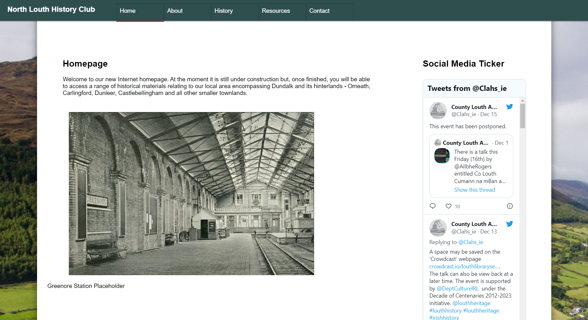

# Site Overview
The name of my Code Institute PP1 site is "North Louth History Club". As the name suggests, it is a site which curates and hosts information about the North Louth area. This site is aimed at North Louth locals in particular, followed by Irish people, followed by anyone who would happen to stumble upon it and take an interest. 
# Table of Contents
* [Technologies Used](#technologies-used)
* [Features](#features)
* [Design](#design) 
    * [Inspiration](#inspiration)
   
* [Testing](#testing)
    * [Manual Testing](#manual-testing)
    * [Lighthouse Testing](#lighthouse-testing)
    * [Validator Testing](#validator-testing)
    * [Bugs](#bugs)  
* [Credits](#credits)  


## Technologies Used

HTML5

CSS3

------

## Features

Flexbox styling; complete continuity and preservation of features from Desktop to mobile, responsive design from 1920x1080 down to 1152x864 in full desktop mode and support for practically any mobile device.

Hamburger menu in mobile mode

Confirmation page upon submission of Contact form

We continually tweak and adjust this template to help give you the best experience. Here is the version history:

**September 1 2021:** Remove `PGHOSTADDR` environment variable.


------

## Testing 

I tested the website in Chrome on my desktop and Chrome on my Android devices - methodically testing core elements on each page, zooming out, changing to landscape,
etc - through this testing I discovered many actions which "broke" my website or which had somehow slipped thru the cracks 
causing for e.g the hamburger menu to work on one page but not another.

I also tested the website on Firefox and Edge - I do not have access to a Mac computer nor a Mac VM to test through Safari.

I ran the website through W3C validator to see if anything was outdated, bad practice, outright wrong, etc and fixed accordingly.

I ran the website through Chrome's Lighthouse.

Lighthouse asked me to convert all images to Webp.

Lighthouse also complains about the size of the embedded video; but to stream more efficiently and download a buffer bit-by-bit 
would require the javascript-based Media Source API - which due to the presence of javascript is beyond the scope of this project.

Alternatively I could host it on a CDN - but again, to have my own CDN is beyond the scope of this project and 
I already have a CDN-hosted video on this particular webpage - namely the embedded YouTube video.

Before testing explicitly; I had first rendered the video captured from a Facebook page as a 1080p video; but quickly realized my mistake and
rendered it again as a 540p video; cutting the filesize in half.

Admittedly also I did not notice any exceptional difference in loading a 100kb page vs. a 40,000kb page with video as my connection is
a 500Mbps fibre to the home one (which equates to 62,500 kilobytes per second download speed) - in future I must always keep in mind the fact that a 
great number of users will be accessing from sub-100Mbps and sub-10Mbps connections. 
Indeed upon testing the website from my phone's 4G connection I found the video to load painfully slowly - I set up a timer 
and it took a  pitiful 1 minutes 30 seconds to start playing the video; presumably it was downloading the whole thing at once 
rather than a piecemeal buffering setup.

The most I can do, to my knowledge, is change preload="true" to preload="none" or "metadata" - which I have done and which does seem to cut down on pageload times.


In the process of fixing errors with the navbar yet preserving styling and turning the page title into a Homepage link, I added the class "nav" to all of my
"a href" navigation buttons - which conflicted with the class named "current" which I applied to the page the user was on 
to add a little underline to the relevant navbar button. Upon noticing this (actually days) later and after some brief deliberation, I realized "id" was more
appropriate for this "current" type of styling as there is only *one* element on each page which will need to have that specific style applied to it, while a "class" can apply to many elements. - so "class=current" became "id=current".

Throughout the project the footer would mess up on mobile (and sometimes on desktop) and appear halfway up the page or at the end of the initial viewport rather than "sticking" to the exact bottom of the page - or otherwise it would appear at the bottom but in a broken/glitched state. I have not been able to figure out why this is for the past month or so; it worked fine initially but now it seems irreparably bugged - I would normally try and fix it before submission but in this case I feel as if I have made the CSS too convoluted, being that it's my first time writing a responsive webpage and that I originally started it in a fixed, desktop mindset using px, float, static widths etc - it feels intimidatingly long and detailed and I think the only thing for it would be to destroy all the CSS and write it from scratch - so instead, as the deadline is approaching fast - I have just set it to "display:none" on mobile.

I had an issue with flexboxes being out of alignment with eachother - I put borders on the flexi divs and discovered the "aside" flex wasn't sticking to the top of the page. From here it was a matter of adding "top: 0; position: sticky; align-self: flex-start;" to aside and padding it accordingly to max with the main div. It now looks a lot cleaner, although by no means perfect.

One other issue was that, in tablet/narrow browser tab display mode aka 1151px in the stylesheet, I had a quite lot of irremovable whitespace before the first Flexbox div on the Home & About pages - this did not show up in the mobile phone display mode nor the desktop mode. I was quite stumped as to how to fix this for some time but; after investigating thru Chrome developer tools (and the equivalent forks of this same tool in Firefox and Edge; since both are based on Chrome) I discovered that Chrome was overriding my stylesheet in this "tablet/narrow browser tab" display mode - for reasons unknown, it was applying "display: block" to Flexbox children. After a lot of Google searches and rewriting my search terms; I stumbled upon the fix that worked, which was to apply "justify-content: flex-start;" to the parent div.


**Why have you added this script?**

It will help us to calculate how many running workspaces there are at any one time, which greatly helps us with cost and capacity planning. It will help us decide on the future direction of our cloud-based IDE strategy.

**How will this affect me?**

For everyday usage of Gitpod, it doesn’t have any effect at all. The script only captures the following data:

- An ID that is randomly generated each time the workspace is started.
- The current date and time
- The workspace status of “started” or “running”, which is sent every 5 minutes.

It is not possible for us or anyone else to trace the random ID back to an individual, and no personal data is being captured. It will not slow down the workspace or affect your work.

**So….?**

We want to tell you this so that we are being completely transparent about the data we collect and what we do with it.

**Can I opt out?**

Yes, you can. Since no personally identifiable information is being captured, we'd appreciate it if you let the script run; however if you are unhappy with the idea, simply run the following commands from the terminal window after creating the workspace, and this will remove the uptime script:

```
pkill uptime.sh
rm .vscode/uptime.sh
```

**Anything more?**

Yes! We'd strongly encourage you to look at the source code of the `uptime.sh` file so that you know what it's doing. As future software developers, it will be great practice to see how these shell scripts work.

---

Happy coding!
